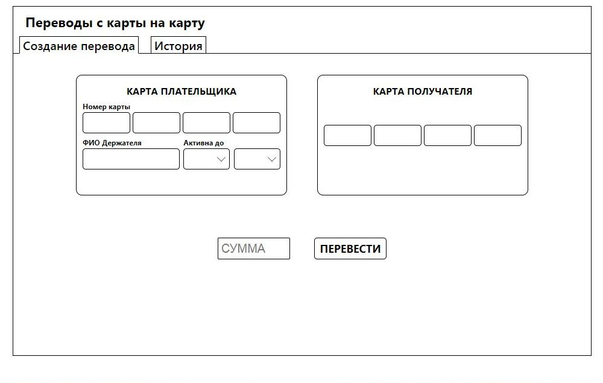
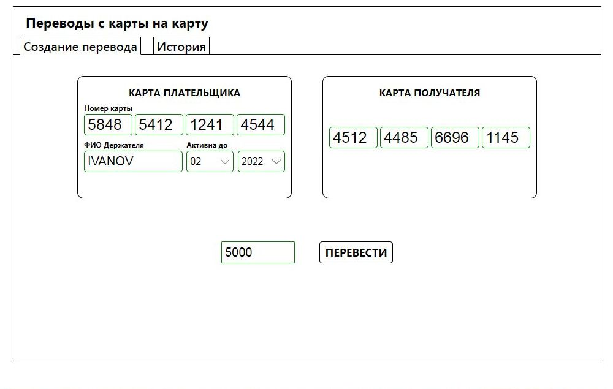
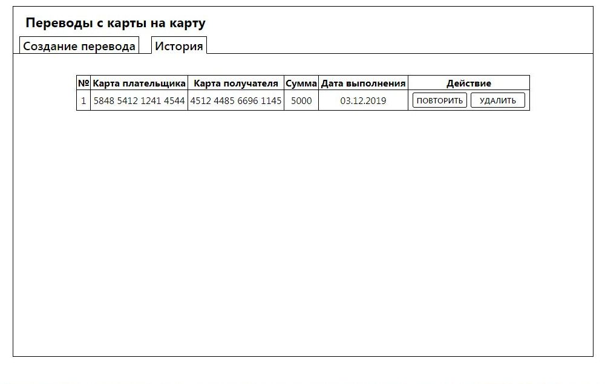
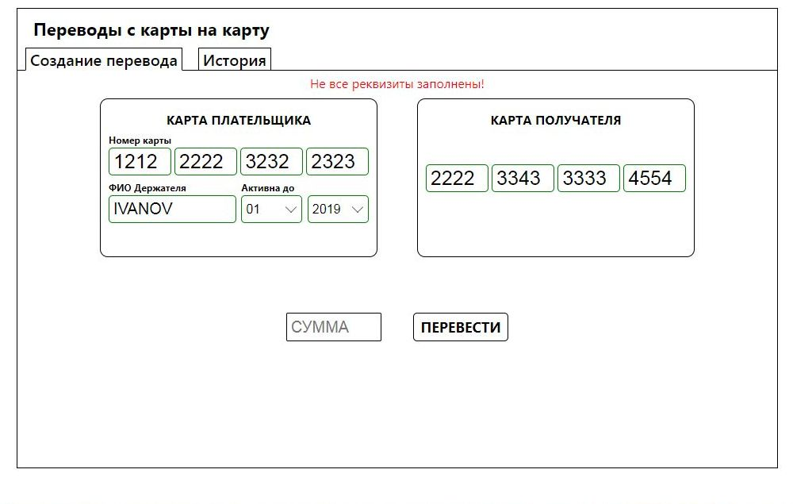

# Money-transfer

Money-transfer - клиентское приложение, реализованное с использованием React.js. Представляет из себя сервис по переводу денег с карты на карту (только его визуальная часть в браузере). 
По умолчанию загружается экран "Создание перевода".

Корректно заполненные поля подсвечиваются зеленым цветом.

При клике по кнопке "Перевести" и успешной валидации полей ввода, приложение переключается на экран "История". История переводов хранится в LocalStorage браузера.

В случае некорректного ввода данных, нажатие на кнопку "Перевести" инициирует появление сообщения об ошибке.

